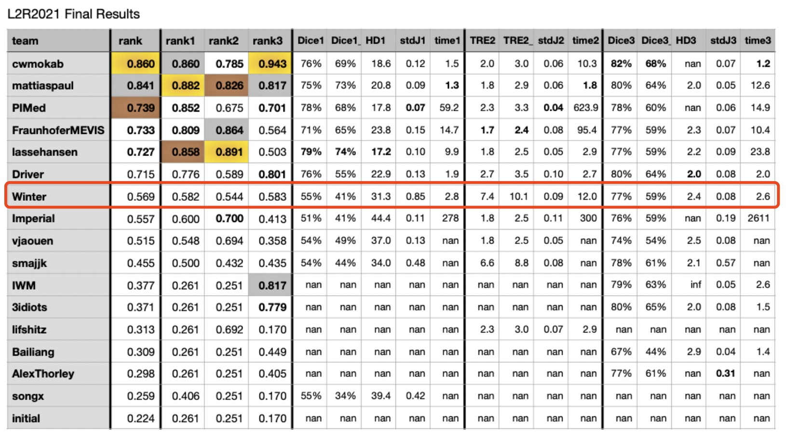
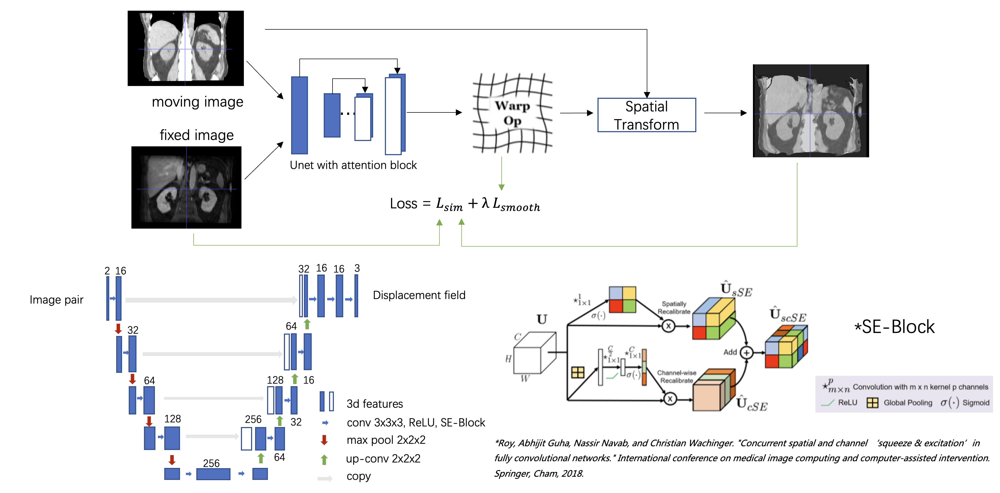
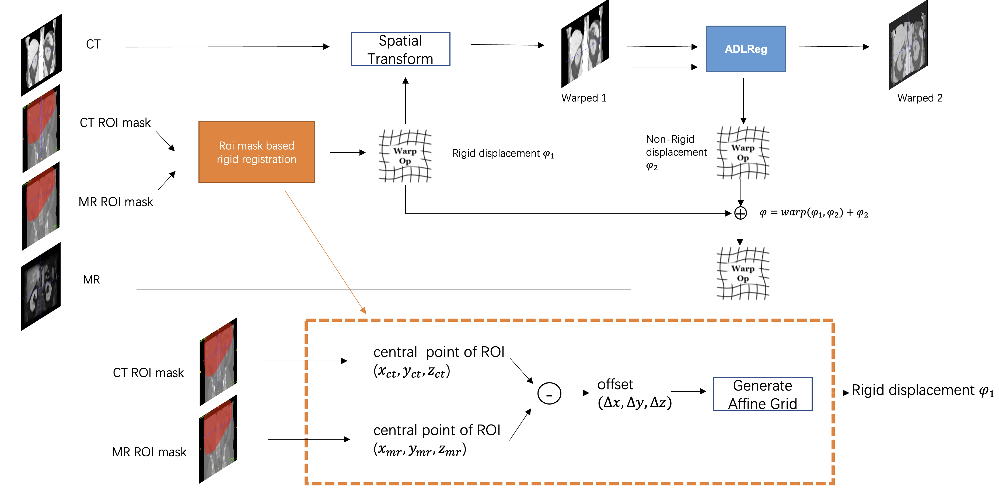

# Winter’s Solutions for Learn2Reg 2021

# overview

Here we briefly introduce our solutions for Learn2Reg 2021. For task 1 and task 3, we proposed a deep learning-based registration algorithm named "Attention-based Deep
Learning Registration (ADLReg). For task 2, we improved the result of a traditional iterative registration method. The details for each task are listed as follows.

## Performance

## framework

Our framework follows [VoxelMorph](https://arxiv.org/abs/1809.05231) but with an attention enhanced U-Net. Wherein, two attention modules including channel attention and spatial attention were utilized after each convolutional layer to help the network better understand the spatial correspondence between features. The network was trained by minimizing image dissimilarity metrics such as mutual information, local normalized cross-correlation, etc. with a transformation regularization of L2 smoothness.

## Task1
The purpose of task 1 was the registration of abdominal intra-patient MRI and CT images. In our exploratory experiments, we found that there exists a large misalignment between the original MRI and CT images, which cannot be directly solved by the learning-based registration method. To address such problem, we proposed to register the images via a twostage strategy including a slice position calibration process and a learning-based non-rigid registration process. First, slice position calibration with coarse ROI masks was applied to help the following non-rigid registration focus on obtaining the optimal dense transformation. Then, a learning-based network was optimized on the pre-aligned CT and MRI. 

For task 1, CT images were normalized to zero mean and unit variance with intensity truncation to [-200, 100] HU. Besides, the min-max normalization was applied to MRI. We used full-resolution CT and MRI for registration. The network was trained by minimizing mutual information (MI) based image dissimilarity with a transformation regularization of L2 smoothness. The strength was set to 0.5. 

## Task2
Task 2 deals with lung CT registration of inspiration and expiration phases. Our approach is built on top of the classic iterative registration method - [AdamReg](https://gist.github.com/mattiaspaul/d314c22ac97d37c2cf05e99780bd54c4). Specifically, we introduced the modality independent neighborhood descriptor based self-similarity context (MINDSSC) as the representation of the to-be-aligned images. Then, we adopt a patch-based strategy to perform better registration locally. The registration process is optimized with the commonly used mean square error (MSE) for image dissimilarity and the L2 smoothness regularization for the deformation fields.

## Task3
Task 3 aims to align unimodal brain MR images among different patients. We use skullstripped and bias-corrected (norm) MRI to develop our algorithm. Our method takes full resolution MRI as the input. We use the same backbone and regularization as that of task 1 yet with local normalized cross-correlation (LNCC) as the image dissimilarity metric. The strength of transformation regularization of L2 smoothness was set to 2. 

## Contact
For any problems or questions please open an issue.
